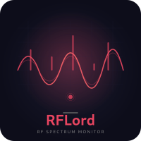

<p align="center">
  
</p>

<h1 align="center">RFLord</h1>

<p align="center">
  <b>Real-time RF Spectrum Monitor with Unified Threat Assessment</b><br>
  <sub>WiFi + BLE + RF signal detection · Rule engine · Voice alerts · Web dashboard</sub>
</p>

<p align="center">
  
  
  
  
</p>

---

## What is RFLord?

RFLord is a real-time RF spectrum monitor for the ClockworkPi uConsole with HackRF One and/or RTL-SDR. It scans all bands, identifies signals using multiple databases, and provides unified threat assessments by combining RF, WiFi, and BLE signals through a boolean rule engine.

### Key Features

- **Dual-SDR parallel scanning** — HackRF + RTL-SDR simultaneously, ~50% faster
- **Unified rule engine** — combines RF, WiFi, and BLE signals into named threat detections
- **1,355 signatures** across 5 databases (Artemis, spy devices, drones, RF protocols, AirHound)
- **Voice alerts** — HAL 9000 TTS voice announcing threats (threaded, non-blocking)
- **Web dashboard** — live signal stream via Flask SSE on port 8080
- **Signal history** — SQLite-backed trend tracking with `l` (log) and `h` (history) views
- **Export** — CSV/JSON export of scan results
- **Suppress mode** — jam cellular/Bluetooth/GPS bands with HackRF TX

## Screenshots

```
 RfLord v0.7.0 14:32:15 │ Up 00:05:23 │ Alerts 12 │ Tracked 45 │ Sig 838
 Web Dashboard: http://192.168.0.214:8080
 🔴 Threats detected: Flock Safety Camera [wifi+ble] (100%) — ALPR camera
                         SUSPICIOUS                                     KNOWN SIGNALS
!      Freq   Pwr  Std  Dist Type           Desc    Cnt    Pwr  Dist  Bnd Type
 ─────────────────────────────────────────────────── ──────────────────────────────
 !!  680.0 -30.0  2.5  333m Tetrapol      Tetrapol  x152  -21.0  29m   5G 802.11n
 !!  433.0 -12.7  3.2  520m Link-11       Link-11    x76  -31.6 346m    L CDMA2000
 !   140.5 -11.5  4.9  807m Kiwi          Kiwi       x42  -25.5 256m    ? 3G WCDMA
 ─────────────────────────────────────────────────── ──────────────────────────────
 q:Quit  r:Rescan  v:Voice  m:Mute  s:Suppress  ↑↓:Navigate  d:Detail  e:Export
```

## Hotkeys

| Key | Action |
|-----|--------|
| `q` | Quit |
| `r` | Force rescan |
| `v` | Voice: speak current status |
| `m` | Mute/unmute voice alerts |
| `s` | Suppress mode (jam selected bands) |
| `+`/`-` | Increase/decrease scan interval |
| `↑`/`↓` | Navigate signals in active panel |
| `←`/`→` | Switch between SUSPICIOUS/KNOWN panels |
| `d` | Signal detail popup (full description, scrollable) |
| `e` | Export current scan to CSV/JSON |
| `l` | View system log |
| `h` | View signal history |
| `ESC` | Deactivate cursor |

## Installation

```bash
# Clone
git clone https://github.com/ihorman/rflord.git
cd rflord

# Dependencies
pip3 install flask numpy

# Build signature database
python3 build_signatures_db.py

# Run
python3 rflord.py
```

### Hardware Requirements

- ClockworkPi uConsole (CM4/CM5)
- HackRF One SDR (primary, wideband)
- RTL-SDR v3/v4 (optional, parallel UHF/VHF scanning)

## Architecture

### Rule Engine

RFLord uses a boolean rule engine (modeled after [AirHound](https://github.com/dougborg/AirHound)) to combine signals from multiple sources into named threat detections:

```
RF Signal (433.92 MHz)  ─┐
WiFi MAC (B4:1E:52:xx)  ─┼─ Rule Engine ─→ "Flock Safety Camera [wifi+rf]"
BLE UUID (0x3100)       ─┘                  Confidence: 100%  Threat: CRITICAL
```

Rules use boolean logic:
```json
{"anyOf": ["mac_oui:B4:1E:52", "ssid_pattern:^Flock-", "ble_name:flock"]}
```

### Signal Databases

| Database | Entries | Source | Content |
|----------|---------|--------|---------|
| Artemis 3 | 427 | sigidwiki.com | RF signal identifications |
| Spy DB | 81 | rflord | Surveillance devices, cameras, bugs, jammers |
| Drone RF | 45 | rflord | Drone control/video protocols |
| RF Protocols | 692 | ringmast4r | Sub-GHz ISM devices |
| AirHound | 103 | dougborg/AirHound | MAC OUIs, BLE UUIDs, SSID patterns |

### WiFi Scanning

RFLord periodically scans WiFi networks using `iw dev <iface> scan` and matches:
- MAC OUI prefixes against known surveillance camera manufacturers
- SSID patterns against regex patterns (e.g., `Flock-XXXXXX`)

### BLE Scanning

RFLord periodically scans BLE devices using `hcitool lescan` and matches:
- Service UUIDs (Raven acoustic sensors, Open Drone ID)
- Device names (Flock Safety, card skimmers)
- Manufacturer IDs (XUNTONG/Flock Safety)

## Web Dashboard

Enable in `config.yaml`:
```yaml
web:
  enabled: true
  port: 8080
```

Access from any device on the same network: `http://<uconsole-ip>:8080`

The dashboard shows:
- Live signal stream via Server-Sent Events (SSE)
- Suspicious vs known signals
- Signal details (frequency, power, distance, type)
- Alert count and uptime

## Configuration

Default config at `~/.config/rflord/config.yaml`:

```yaml
scan:
  interval: 30  # seconds between scans
voice:
  enabled: true
  threshold: -50  # dBFS minimum for voice alerts
history:
  enabled: true
  db_path: ~/.local/share/rflord/history.db
  max_days: 30
export:
  format: csv
  path: ~/.local/share/rflord/exports/
web:
  enabled: true
  port: 8080
blacklist:
  file: ~/.config/rflord/ignore.conf
```

## File Structure

```
rflord/
├── rflord.py              # Main application (curses + ANSI modes)
├── rule_engine.py          # Unified RF+WiFi+BLE threat assessment
├── signatures_db.py        # Unified SQLite signature database API
├── build_signatures_db.py  # Migration script for signature database
├── web.py                  # Flask + SSE web dashboard
├── history.py              # SQLite signal history tracker
├── spy_db.py               # Surveillance device database
├── drone_rf_db.py          # Drone RF signature database
├── rf_protocols.py         # Sub-GHz protocol database
├── config.py               # YAML config loader
├── blacklist.py            # Signal blacklist/ignore
├── scan_accel.py           # Adaptive scan acceleration
├── export.py               # CSV/JSON export
├── tests/                  # Test suite (150 tests)
├── logo.svg                # Vector logo
├── logo.png                # Raster logo
└── README.md               # This file
```

## Testing

```bash
python3 -m pytest tests/ -v
```

150 tests across 6 test files:
- `test_hotkeys.py` — Key mapping, log/history views, suppress menu
- `test_hackrf_switcher.py` — Device detection, PortaPack switching
- `test_table_alignment.py` — Column alignment, distance formatting
- `test_new_modules.py` — Config, blacklist, scan acceleration, history

## Author

**Ihor Kolodyuk** — [github.com/ihorman](https://github.com/ihorman)

## Credits

- [AirHound](https://github.com/dougborg/AirHound) — WiFi/BLE surveillance detection signatures and rule engine pattern
- [ringmast4r/RF-Protocol-Database](https://github.com/ringmast4r/RF-Protocol-Database) — 692 Sub-GHz protocol signatures
- [Artemis 3](https://www.sigidwiki.com) — RF signal identification database
- [ClockworkPi](https://clockworkpi.com) — uConsole hardware

## License

MIT

---

<p align="center">
  <sub>Built with ❤️ for the RF hacking community</sub>
</p>
